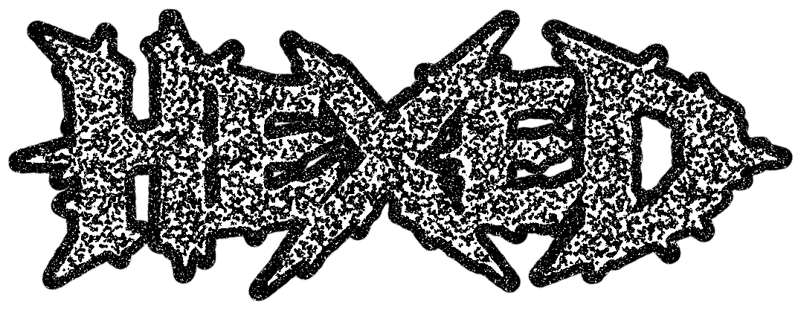

<div align="center">
  
  
  <br/>
  <br/>
  
  **Image-to-Color-System Compiler for Claude Skills**
  
  [](LICENSE)
  []()
  []()
  
</div>

---

# Hexed

Hexed is a Claude skill that extracts structured color systems from images.

## What It Does

- Accepts 1-5 images (PNG, JPG, WebP)
- Extracts dominant colors using histogram analysis
- Builds a complete design system with:
  - Core colors (primary, secondary, accent)
  - Neutral ramp (10 steps)
  - Semantic colors (success, warning, error, info)
  - Light and dark UI themes
- Exports to CSS variables, Tailwind config, or Figma tokens

## Installation

### For Claude Users

Install Hexed from the [Claude Skills marketplace](https://claude.ai):
1. Go to Settings → Skills
2. Search for "Hexed"
3. Click "Add Skill"

See [INSTALLATION.md](INSTALLATION.md) for detailed instructions.

### For Developers

To run locally or integrate into your own projects:

```bash
pip install pillow numpy
python test_hexed.py path/to/image.png
```

## Files

- `SKILL.md` - Instructions for Claude on how to use the skill
- `hexed_compiler.py` - Core color extraction and system building logic
- `hexed_exports.py` - Export utilities (CSS, Tailwind, Figma)
- `test_hexed.py` - Test script to verify functionality

## Usage

When a user uploads images and asks for color extraction:

1. Check `/mnt/user-data/uploads/` for images
2. Import and run the compiler:
   ```python
   from hexed_compiler import compile_from_images
   result = compile_from_images(image_paths)
   ```
3. Export to desired format:
   ```python
   from hexed_exports import export_css_variables
   css = export_css_variables(result['color_system'])
   ```
4. Save to `/mnt/user-data/outputs/` and present to user

See `SKILL.md` for complete usage instructions.

## Testing

To test the skill:

```bash
python test_hexed.py /path/to/image1.png /path/to/image2.jpg
```

This will:
- Process the images
- Show extracted colors
- Generate all export formats
- Save outputs to `test_output/`

## Algorithm

1. **Resize**: Images scaled to 768px max dimension
2. **Quantize**: Colors bucketed into 24-step buckets (faster, coarser grouping)
3. **Histogram**: Count pixel frequencies per bucket
4. **Rank**: Sort by frequency
5. **Pick**: Select top 8 distinct colors (40+ RGB distance minimum)
6. **Map**: Assign extracted colors to structured system roles

## Export Formats

### CSS Variables
```css
:root {
  --color-primary: #3B6EF5;
  --neutral-500: #7E8AA3;
}

[data-theme="light"] {
  --background: #F7F8FA;
}
```

### Tailwind Config
```javascript
export default {
  theme: {
    extend: {
      colors: {
        primary: "#3B6EF5",
        neutral: { "500": "#7E8AA3" }
      }
    }
  }
};
```

### Figma Tokens
JSON compatible with Tokens Studio for Figma plugin.

## Limitations

- Max 5 images per compilation
- Images resized to 768px for processing
- Deterministic but approximate (histogram-based)
- No image generation or layout creation
- Each compilation is independent (no persistence)

## Version

Current version: 0.2.0 (Python port)

Original Next.js version: 0.1.0

## Author

Created by Heathen ([@heathenft](https://x.com/heathenft))

Built in ([Mirra](https://getmirra.app))

## License

MIT License

Copyright (c) 2026 Heathen

Permission is hereby granted, free of charge, to any person obtaining a copy
of this software and associated documentation files (the "Software"), to deal
in the Software without restriction, including without limitation the rights
to use, copy, modify, merge, publish, distribute, sublicense, and/or sell
copies of the Software, and to permit persons to whom the Software is
furnished to do so, subject to the following conditions:

The above copyright notice and this permission notice shall be included in all
copies or substantial portions of the Software.

THE SOFTWARE IS PROVIDED "AS IS", WITHOUT WARRANTY OF ANY KIND, EXPRESS OR
IMPLIED, INCLUDING BUT NOT LIMITED TO THE WARRANTIES OF MERCHANTABILITY,
FITNESS FOR A PARTICULAR PURPOSE AND NONINFRINGEMENT. IN NO EVENT SHALL THE
AUTHORS OR COPYRIGHT HOLDERS BE LIABLE FOR ANY CLAIM, DAMAGES OR OTHER
LIABILITY, WHETHER IN AN ACTION OF CONTRACT, TORT OR OTHERWISE, ARISING FROM,
OUT OF OR IN CONNECTION WITH THE SOFTWARE OR THE USE OR OTHER DEALINGS IN THE
SOFTWARE.
